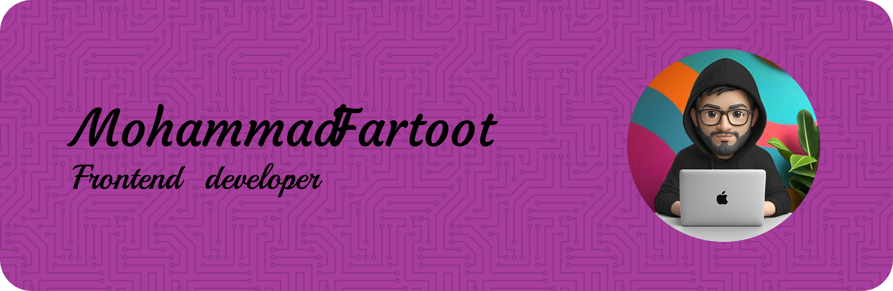

### Hi, I'm Mohammad 👋🏻🧑🏻‍💻  
 

I'm a fronend developer with a strong passion for JavaScript. 
I truly enjoy working with modern technologies like React and Next.js. 
Building fast and beautiful user experiences is something i truly care about.

 

 

# 📊 GitHub Stats:
 
 

### 🔝 Top Contributed Repo

---

